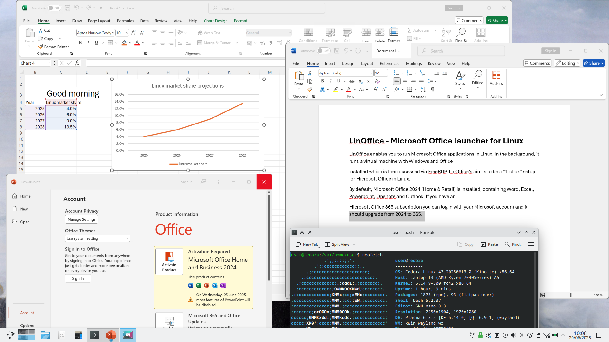

# LinOffice - Microsoft Office launcher for Linux

**LinOffice enables you to run Microsoft Office applications in Linux.** In the background, it runs a virtual machine with Windows and Office installed which is then accessed via FreeRDP. LinOffice's aim is to be a "1-click" setup for Microsoft Office in Linux.

By default, **Microsoft Office 2024** (Home & Retail) is installed, containing Word, Excel, Powerpoint, Onenote and Outlook. If you have a **Microsoft Office 365** subscription you can log in with your Microsoft account and it should upgrade from 2024 to 365.

# Screenshot

.

# Features

This project is a fork of [Winapps](https://github.com/winapps-org/winapps), which the main differences being:
- 1-click-install and suitable for people who have no experience with running virtual machines (at least that's the aim)
- Support only for Microsoft Office, no other Windows applications
- To keep it simple, only supports Podman (with [Dockur/Windows](https://github.com/dockur/windows)) to run the VM, no Docker or Virt-Manager support.

You *can* run LinOffice alongside WinApps - all the names and RDP ports have been changed to avoid conflicts between the two.

List of features inherited from WinApps:

- [x] Run Microsoft Office apps as if they were native Linux apps
- [x] Office apps have access to /home folder and Linux clipboard
- [x] Automatic suspend of the Windows VM when inactive, resume when starting an Office app

Improvements:
- [x] Automatic non-interactive setup just by running the setup script
- [x] Fewer dependencies needed, e.g. no netcat, ipconfig, dialog, libnotify
- [x] Fixed an issue where Office wouldn't start if Windows VM wasn't booted 
- [x] Automatic deletion of Office lock files (like ~$file.docx) which for some reason don't get deleted on the RDP-mounted /home drive
- [x] Force time sync in Windows VM after Linux host wakes up from sleep, to avoid time drift
- [x] International support: Automatic detection of language, date format, thousand and decimal separator, currency symbol, keyboard layout etc. in the Linux system to apply the same in the Windows VM (so that you don't have to deal with mm/dd/yyyy if you're not American!). Avoid geo-restrictions for Office install.
- [x] Script to install updates for Windows and Office
- [x] Time zone set to UTC to avoid issues with timestamps when saving in the /home folder
- [x] Tidy up the Quick Access pane in Windows File Explorer

### Planned features

- [ ] Find a more elegant way of dealing with orphaned Office lock files (need to find the root cause of why they're not being deleted by Office)
- [ ] Option to deny network access to VM (after Office is all set up). The first aim is to avoid Windows and Office "phoning home", which could perhaps be done by setting the Windows DNS server to IP that doesn't work. It would also be nice to completely stop all non-RDP network traffic to reduce security risks for users who don't keep their Windows VM updated
- [ ] GUI
    - [ ] Install wizard replacing `setup.sh`
    - [ ] Set display scaling
    - [ ] Explicitly set regional settings, keyboard layout, time zone (e.g. for Excel's `=NOW()` formula) for the VM
    - [ ] Quick actions e.g. run Windows Update, open Powershell, open Office Language Settings, clean orphaned lock files form /home folder
    - [ ] Troubleshooting e.g. recreate .desktop files, RDP & Office check, restart container, reboot Windows VM, general health check
    - [ ] Uninstall (with or without removing the container and its volume)
- [ ] Deliver as Flatpak or AppImage, which would have these benefits:
    - Bundles dependencies such as FreeRDP and Podman-Compose; only Podman would need to be installed on the system already
    - Installation and uninstallation more straight-forward for Linux beginners

### Nice to have but lower priority

- [ ] ARM support (should be possible as both Windows and Office have ARM versions)
- [ ] Support for non-core Office apps (e.g. Access, Publisher, Visio)
- [ ] Support for older Office versions (e.g. 2016, 2019, 2021)

# Installation

### Requirements

All Linux distributions are supported.

Hardware requirements:
- Sufficient resources (the Windows VM is allowed to take up to 4 GB RAM, 64 GB storage and 4 CPU cores if needed). The script will check that you have at least 8 GB RAM and 64 GB free storage before proceeding.
- Virtualization support (using kvm)
- x86_64 CPU (ARM is currently not supported, although it would be possible)

Dependencies that need to be installed (they should be in the repos of most distributions):
- Podman
- Podman-Compose
- FreeRDP 

If you are using an immutable distribution like Fedora Atomic or OpenSUSE MicroOS, you should have Podman preinstalled already. Podman-Compose can be [installed in your /home directory](https://github.com/containers/podman-compose?tab=readme-ov-file#manual) and FreeRDP can be [installed as a Flatpak](https://flathub.org/apps/com.freerdp.FreeRDP) (but make sure to give it permission to access the /home folder).

### Install

0. Install the dependencies (see above)
1. Download this repo
2. Save in a convenient folder (e.g. `~/bin` or `~/.local/bin`)
3. Make `setup.sh` executable (`chmod +x setup.sh`) and run it (`./linoffice.sh`).

This should be all automatic but will take quite a while. You need to download about 8 GB in total and wait until both Windows and Office are installed. In my experience, on a modern laptop and with fast Internet, it took about 30 minutes all in, maybe 10 minutes of downloading and 20 minutes of installing.

Unfortunately it is not allowed to redistribute Microsoft software, otherwise I would have just prepared a pre-made VM with Office installed, which would cut down the installation time and make this whole project much simpler. At the moment, the script downloads Windows, installs it into a VM, then downloads Office and installs it in the VM, as well as various other tweaks to integrate Office.

If you need to re-create the .desktop files you can do it by running `./setup.sh --desktop`.

If you want to re-run the script that tidies up the Windows File Explorer you can run `./setup.sh --firstrun`.

### Uninstall

You can run the `uninstall.sh` to remove everything.

If you want to manually remove everything, here's where everything is saved:
- The folder where you have saved the `linoffice.sh` script. This should be self-contained and include all the files in this repo, as well as some additional files created by the setup script (`config/oem/registry/regional_settings.reg`, `config/compose.yaml`, `config/linoffice.conf`).
- The appdata folder for temporary files is in `~/.local/share/linoffice`
- The `.desktop files` (Excel, Onenote, Outlook, Powerpoint, Word) will be created in `~/.local/share/applications`
- The Podman containers can be removed with `podman rm -f LinOffice && podman volume rm linoffice_data`

# Usage

### Starting Office applications

After installation, you should find the launchers for the Office applications in your app menu.

### Opening Office files

You can open files from your file manager with Right-click -> Open with. 

### In the terminal
- `./linoffice.sh [excel|word|powerpoint|onenote|outlook]`: runs one of the predefined Office applications
- `./linoffice.sh manual [explorer.exe|regedit.exe|powershell.exe|cmd.exe]`: runs a specific Windows app
- `./linoffice.sh windows`:  shows the whole Windows desktop in an RDP session
- `./linoffice.sh update`: runs an update script for Windows in Powershell
- `./linoffice.sh reset`: kills all FreeRDP processes, cleans up Office lock files, and reboots the Windows VM
- `./linoffice.sh cleanup [--full|--reset]`: cleans up Office lock files (such as ~$file.xlsx) in the home folder and removable media; --full cleans all files regardless of creation date, --reset resets the last cleanup timestamp

### Office activation 

You will need an Office 2024 license key or Office 365 subscription to use Office. During the first 5 days after installation, you can use Office without activation by clicking on "I have a product key" and then on the "X" of the window where you are supposed to enter your product key.

The Microsoft Activation Scripts will also work if you have trouble with activation - just run `./linoffice.sh manual powershell.exe` from the script's directory to open a Powershell window where you can then paste the command for MAS.

### Window management

In my experience, window management can be wonky, particularly if you're using Wayland instead of X11. Examples:
- Using multiple Office documents/windows can be tricky. For example, opening an Office window might not open until you start it a second time and you may or may not get two windows then. Or, opening a new Office window might close already open ones. Don't panic - your documents are not lost. Just launch the latest Office window again and you should now see both the new one and old one. Sometimes, opening a new windows might also have the quirk that the focus is on the older Office window which is sitting in the background. The solution is to minimize the old one so that the focus is gone..
- Moving and resizing windows does not always work well, particularly on setups with multiple monitors. Most desktop environments use the shortcut "Meta + Left-Click" for moving a window and and "Meta + Right-Click" for resizing; this is a very reliable to move around or resize Office windows.
- Dialog boxes (commonly encountered when working with charts in Excel for example) spawn as new, separate windows, but they can sometimes appear behind the main window and at the same time block the main window until you close the dialog box.
- Dialog windows may also have a bad size, e.g. the "edit chart data" window in Excel often cuts off the "OK" at the bottom. The solution, again, is to resize the window using a shortcut like "Meta + Right-Click" in order to access the "OK" button.

I believe that these issues are upstream in FreeRDP. If it becomes too bad, you can try `./linoffice.sh reset` to kill all FreeRDP processes and reboot the Windows VM - but be aware that you will lose any unsaved Office documents this way.

### Orphaned lock files

There is a strange issue that Microsoft Office will not clean up the lock files in the Linux /home folder. If you open, say, "Book1.xlsx" then Excel will create a file called "~$Book1.xlsx" which is just a few bytes in size and serves the purpose of "locking" this file so other users can't edit it at the same time. Normally these files should be deleted when you close the file, but this doesn't happen for whatever reason. The /home folder is mounted by FreeRDP and appears in Windows as a network drive accessed via RDP Drive Redirection (RDPDR).

LinOffice searches and deletes these lock files when the last Office process is closed. If this fails for any reason you can manually delete all lock files by running `./linoffice.sh cleanup --full`.

#### How to hide these lock files in KDE's Dolphin file manager:

1. Go to KDE `System Settings` -> `Default Applications` -> `File Associations`, then search for the mime type corresponding to .xlsx (in this case it's called `application/vnd.openxmlformats-officedocument.spreadsheetml.sheet`). Select the existing filename pattern (`*.xlsx`) and click `- Remove` and then click `+ Add` and enter `[!~][!$]*.xlsx`. Do the same for docx and pptx, and, if you use them, odt, ods, odp, docm, xlsm and pptm. 

(By default files starting with `~$` have the mime type `application/x-trash`. By making the above change, a file like "~$Book1.xlsx" will be seen as a trash file rather than a spreadsheet.)

2. Open Dolphin, go to `Configure Dolphin` -> `View` and check `[x] Also hide backup files when hiding files`. 

("Backup files" in this case actually refers to all files with the `application/x-trash` mime type.)

### Display scaling

You can set the display scaling by modifying the value for `RDP_SCALE` in the `linoffice.conf.default` (before installation) or `linoffice.conf` (after installation). 

# Legal information

This project is licensed under the GNU AGPL 3. 

The main script (`linoffice.sh`) is forked from [Winapps](https://github.com/winapps-org/winapps), AGPL license.

The Windows VM is set up using the [Dockur/Windows](https://github.com/dockur/windows) OCI container, MIT license.

Windows 11 and Office 2024 are directly downloaded from Microsoft. This project contains only open-source code and does not distribute any copyrighted material. Any product keys found in the code are just generic placeholders provided by Microsoft for trial purposes. You will need to provide your own product keys to activate Windows and Office.
